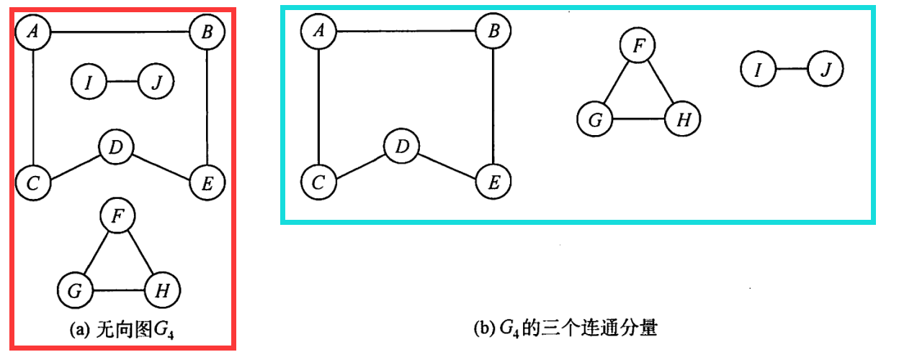
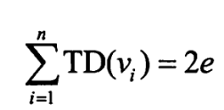
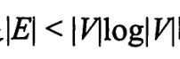
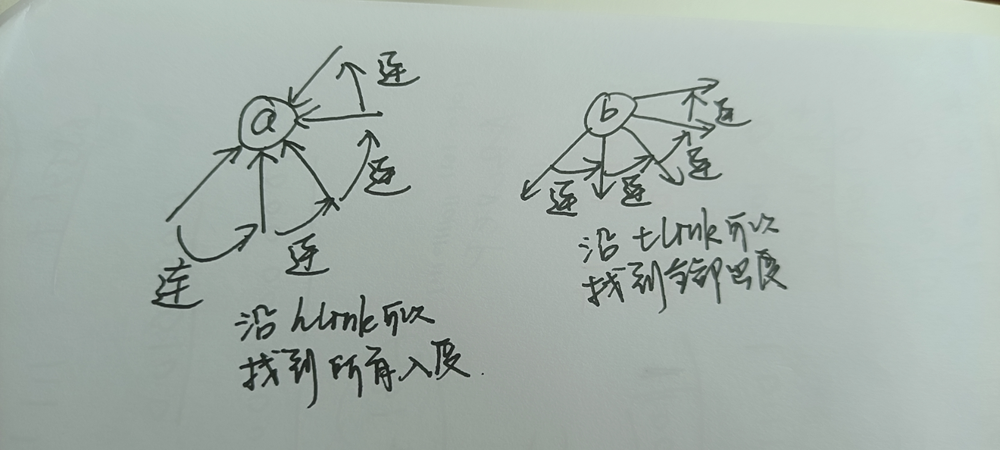

## 图

### 6.1 图基本概念

* 有向图
* 无向图
* 简单图
  * 不存在重复边，不存在顶点到自身的边
  * 可以是无向图也可以是有向图
* 完全图
  * 任意两个顶点之间都存在一条边
  * 无向完全图
    * 当且仅当无向简单图有`n(n-1)/2`条边
  * 有向完全图
    * 当且仅当有向简单图有`n(n - 1)`条边`(2 * n(n - 1))`
* 子图
* 生成子图
  * 保证顶点集是父图的子集
* 连通
  * 连通的概念：如果图中任意两个点都有路径可以到达，则图是连通的
  * 极大连通子图：连通分量**左边红框内是一个图，右边蓝框内是三个连通分量**
  * `n`个节点构成的非连通图，最多有`n-1`条边
* 强连通图
  * 针对于有向图，如果有向图中任意两个节点都互相有路径到达，例如节点v和w，既有`v -> w`的路径，也有`w -> v`的路径，那么图就是强连通的
  * 强连通分量
  * `n`个顶点构成的有向图如果是强连通的，则最少有`n`条边
* 生成树
  * 概念：包含图全部顶点的一个极小连通子图，所以`n`个顶点有`n  - 1`条边(和树是相同的)
  * 极大连通子图：是无向图的连通分量，并且保证**所有的边**都要被被包含进来
  * 极小连通子图：要保证图连通并且使得**边的数量最少**
* 度
  * 无向图：
    * 依附于顶点`v`的度条数表示为`TD(v)`，并且对于`n`个顶点，`e`条边的无向图，有，所有顶点的度之和是边数的2倍
      * 理解：每条边都和两个节点关联；对理解造成困扰的地方在于，关于重复计算的考虑，认为同一条边有两个顶点相连，从而导致了计算两个顶点的时候会造成边数的重复计算，但是实际上混淆了度和边的概念，度是针对于每个节点而言的，边才是唯一的，每个节点都有各自的度，所以等式左边是针对于每一个顶点而言，所有顶点的度之和，这么加起来肯定有重复的；等式右边由于每条边都和两个顶点相连，所以一条边为两个顶点各自贡献一个度
  * 有向图
    * 点`v`的出度记为`OD(v)`，点`v`的入度记为`ID(v)`
    * 所有顶点的出度之和等于入度之和，并且等于边数，所有顶点的出度等于边数，想象只看出度，那么每个点发出的边数加起来就是总的边数，与上面`2e`区分在于上面是每个点都重复算了一次，因为无向图没有入度和出度之分
* 边权和网
  * 带权图就是网
* 稠密网、稀疏网
  * 判断标准
* 回路
  * `n`个顶点如果有大于`n - 1`条边，那么一定有回路
* 简单路径
  * 某一个路径序列中不出现重复的点，那就是简单路径
* 简单回路
  * 路径序列只有起点和终点相同
* 距离
  * 针对于两顶点而言，如果两个顶点之间的存在路径并且路径长度最短，则该最短路径称为距离

### 图的存储结构

* 邻接矩阵
* 邻接表
  * 表头节点
    * 节点的权值
    * 指针
  * 边节点
    * 节点的编号
    * 指针
* 十字链表
  * 弧节点——表示每一条弧
    * 该弧的弧头顶点编号
    * 该弧的狐尾顶点编号
    * 弧的信息
    * 弧头相同的下一条弧
    * 弧尾相同的下一条弧
    * 补充理解：以弧为导向进行连接，给定一条弧以后就知道了这个弧的弧头和弧尾分别都是什么节点，然后就把这些节点的出度和入度分别用链表连接起来，如图所示
  * 顶点节点
    * 该顶点的权值或其他信息
    * 保存以该顶点为弧头的第一个弧节点的指针，如上图`a`就的该指针就可以指向最左边的弧
    * 保存以该顶点为弧尾的第一个弧节点的指针，如上图`b`就的该指针就可以指向最左边的弧
* 邻接多重表
  * 顶点表
    * 节点的权值或其他信息
    * 指针——仅仅指向了第一条边
  * 边节点
    * 维护顶点的信息(即弧头和弧尾的信息)，并通过两个指针来指向依附于弧头弧尾的下一条边，类似于十字链表

### 图的遍历

* BFS
  * 使用队列进行遍历
  * 可以直接求单源最短路径长度，只能求边权为1的图；如果要想求路径的话需要用一个辅助数组作来记录前驱
    * 理解：早上很困的时候想不明白如果造成了重复访问，或者说可以松弛的时候要怎么办，首先是不可能重复访问，因为有visit数组的存在，其次就是不可能松弛，因为边权都是1
  * 由点不可能重复访问，所以BFS可以得到生成树
* DFS
  * 时间复杂度
    * 如果是邻接矩阵，那就是`n ^ 2`
    * 如果是邻接表，那就是`边数+点数`
    * 和BFS的时间复杂度是一样的，因为对于每一个点都要搜索他的邻接点，不用刻意想的太复杂，就是对于邻接表和邻接矩阵，都必须要保证访问到所有的元素，又由于visit数组的存在，所以所求的时间复杂度就已经是最简单的情况了

### 6.3.4 题目(09-07忘带文件夹）

选择

* 3：CACA
* 10：C
* 12：B

综合应用题
