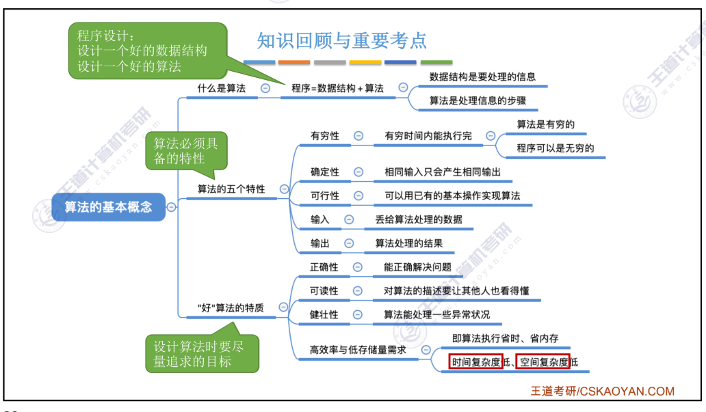

* 思维导图
* 数据的类型
  * 原子类型
  * 结构类型
  * 抽象数据类型
* 数据结构的三要素
  * 数据的逻辑结构
    * 线性结构
      * 线性表
      * 受限的线性表
        * 栈、队列
        * 串
      * 线性表的推广
        * 数组
    * 非线性结构
      * 集合
      * 树形结构：二叉树和一般的树
      * 图状结构：有向图和无向图
  * 数据的存储结构
    * 顺序存储
    * 链式存储
    * 索引存储：存储数据结构元素的信息的同时还会存储一个额外的索引表来指向元素
    * 散列存储：通过关键字可以直接知道元素的存储地址，具体的方式
  * 数据的运算
* 算法
  * 5个特征：有穷性、确定性、正确性、输入(0个或者多个)、输出(1个或者多个)
  * 好的算法的目标：正确性、可读性、健壮性、高效率和低存储量需求
