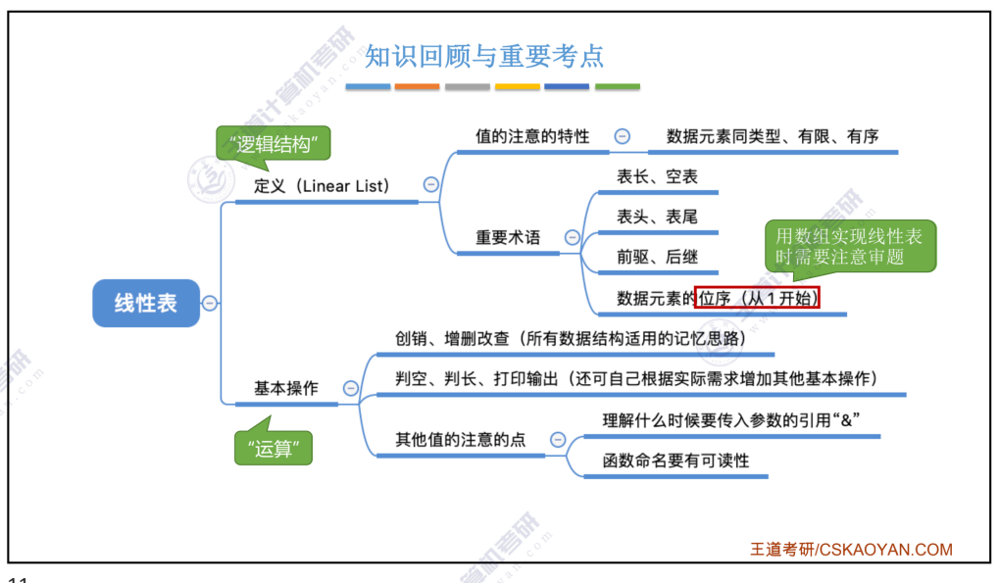
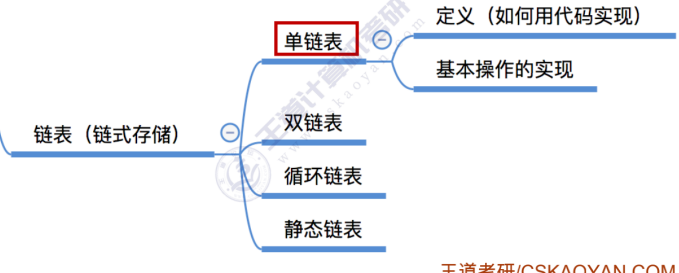

1. 思维导图
2. 常用的线性表操作：
   1. InitList(&L)：初始化表
   2. Length(L):求表长
   3. LocateElem(L, e):按值查找操作，根据值返回对应的线性表元素
   4. GetList(L, i):按位查找操作，找到表中第i个位置的元素
   5. ListInsert(&L, i, e):插入操作，在第i个位置插入，然后返回他的值e
   6. ListDelete(&L, i, e):删除操作
   7. PrintList(L):打印整个线性表
   8. DestroyList(&L):销毁整个线性表
   9. Empty(L):判断表是否为空表
3. 线性表的顺序表示
   1. 顺序表的逻辑顺序和物理顺序相同
   2. 最主要的特点是支持随即访问，确定是插入和删除的时候需要移动大量的元素
   3. 回答课本P14页的注意事项：位序是对外界提供的，所以从1到length都是合法的位置，但是由于底层实现的时候是使用数组，而数组对程序员不是透明的，所以程序员需要对给定为序和数组下标之间自己进行1个单位的偏移的转换
   4. 顺序表插入和删除操作最好的情况都是只对表位元素进行操作，最坏的情况都是对表头的元素进行操作
   5. 数据的结构的存储密度指的冗余信息的量，如果一个数据结构的存储密度较大，那么它的冗余信息就会比较少(P16 第一题)
   6. 顺序表的动态分配算法中，如果需要申请额外的空间，如果新的空间足够存放原来的数据元素以及新增加区域的大小时则分配成功，但是分配以后还要将原来的数据复制到新的区域当中去——P17 11题
4. 线性表的链式表示
   1. 思维导图
   2. 头节点和头指针不同，头指针无论如何都会有，但是头节点不一定有；但是当设置一个哨兵节点的时候，头指针就不可能悬空了，无论如何都会指向第一个头节点
   3. 单链表的基本操作
      1. 插入
         1. 分为头插法和尾插法
            1. 头插法读入数据的顺序和链表中的元素顺序是相反的，插入的时间复杂度是常数级别的
            2. 如果设置了尾指针的时候，尾插法的时间复杂度也是常数级别的，否则就是O(n)
      2. 按序查找
      3. 按值查找
      4. 插入节点
         1. 前插：给定位置i，插入到i - 1的位置，时间复杂度为O(n)，主要花费是找前驱；
         2. 后插：可以仍然采用前插的方式，然后插入完成以后再交换两个节点数据域的内容即可，时间复杂度是O(1)
      5. 删除节点：时间复杂度O(n)，主要的时间花费是找到待删除节点，即遍历链表，直到某一个节点的next指向了待删除节点；存在时间复杂度为常数级别的做法，即只需要操作next->next即可
      6. 求表长
   4. 双链表
      1. 增设前驱指针
      2. 增加了前驱指针以后，插入删除的时间复杂度都是O(1)
      3. 基本操作：
         1. 插入：插入的时候注意不要丢掉前驱节点的next指针
         2. 删除
   5. 循环单链表：最后一个节点的next指针指向头节点
      1. 判空的条件就是头节点的指针是否等于头指针
      2. 插入的时间复杂度是O(n)，但是如果增设尾指针的话头插和尾插的时间复杂度都是O(1)
   6. 循环双链表
      1. 在循环单链表中增设前驱指针
   7. 静态链表：设置一块连续的内存空间，此时next变量的类型就不是指针了，而是整型
5. 顺序表和链表的比较
   1. 存取方式
   2. 逻辑结构和物理结构的关联
   3. 增删查操作
   4. 空间分配
6. 实际应用中顺序表和链表的选取
   1. 基于存储的考虑：是否能够预先知道数据的大小？对数据密度是否有要求？
   2. 基础运算的考虑：插入和删除多还是查找多？
   3. 基于环境的考虑：如果想简单就选择顺序表
7.
