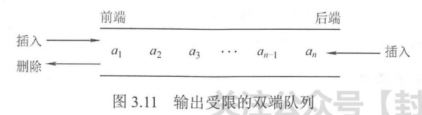

## 栈和队列

### 栈

#### 3.1.1

* 栈的数学性质，卡特兰数，表示n个不同的元素进栈以后可能的出栈顺序
* 栈的基本操作和域的设置
  * 栈顶指针初始的时候设置为-1
  * 进栈操作：栈不满时，先加1再进栈
  * 出栈操作：栈非空时，先取出栈顶元素的值然后再将栈顶指针减1
  * 栈空条件：top == 1
  * 栈满条件：top == MaxSize - 1
  * 栈长：top + 1
  * 栈顶指针top
    * 可以指向栈顶的元素(初值为-1)，也可以指向下一个待插入的位置(初值为0，此时入栈就是先插入元素指针再上移)
* 顺序栈的特点，出栈的时候，元素并没有被释放掉，只是不在栈中了，但是还在内存中，下次再有新的元素入栈的时候，只是把原来的元素覆盖掉
* 共享栈
  * 
  * 链式栈
    * 单链表的头插和头删
  * 我大概摸索出了这样的规律，依据进栈元素的顺序，当元素X出栈的时候，它的前一个出栈的元素或者后一个出栈的元素只能是入栈顺序中与之相邻的元素

### 队列

#### 3.2.2队列的顺序存储结构

* 队列的顺序存储可能会造成假溢出
* 针对可能出现的假溢出，提出了循环队列
  * 
  * 其中队列的长度length = (rear - front + size) % size，最开始不理解为什么要加上size，作用就是rear可能会小于front，所以为了保证被除数是正数，所以需要加上maxSize
  * 判断队空还是队满的方式是front == rear，但是当队满的时候，即rear追赶上了front时，同样满足rear == front，所以仅仅使用rear == front无法判断队空还是队满，解决的方式有如下三种
    * 方法一：牺牲一个存储单元，初始队空的时候rear == front，队满时(rear + 1) % maxSize == front，加1指的就是牺牲的那个单元，队maxSize取余是因为当rear指向5的时候，加1到0，所以对队列尺寸取余
    * 队列类型中增加一个域表示队列中数据成员的个数
    * 由于rear == front既可以表示队空也可以表示队满，所以只需增设一个tag变量，分别表示是因为插入或者删除导致的rear == front即可做出区分；
      * 具体的操作为删除时令tag == 0，插入时令tag == 1，如果某一时刻判断rear == front，同时再判断tag的值，如果为0则表示队空，如果为1则表示队满

#### 3.2.3 队列的链式存储结构

1. 队列的链式存储
   1. 带头指针和尾指针的单链表
   2. 当front指针和rear指针都等于NULL的时候，队空
2. 双端队列
   1. 两端都可以进队和出队的队列
3. 输出受限的队列
   1. 一端可以出队和入队，另一端只能入队的队列
4. 输入受限的队列
   1. 一端可以入队和出队，另一端只能出队的队列
