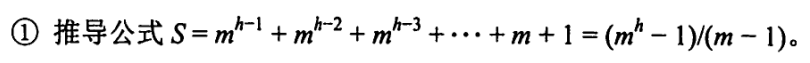
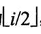
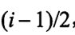

## 树

### 5.1.2 树的定义和基本术语

* 基本术语
  * 
    * 层数和深度都是从1开始数的
    * 节点度数就是孩子的个数
    * 路径长度是边的个数
* 树的性质
  * 树中的结点数等于所有结点的度数之和加1
    * 理解——每个节点都对应着一条边，又由于根节点没有边，所以结点数要比度数多1
  * 度为m的树中第i层有至多个节点
    * 理解：如果第一层也是m个节点，那么第`i`层的结点数就是`m`的`i`次方那么多个节点，但是由于根节点只有一个，所以往下每一层就最多只有个节点了
  * 高度为h的m叉树至多有个节点
    * 理解——等比数列求和公式，上下各自提出一个负号
  * 具有n个节点的m叉树的最小高度为
    * 理解——推导：从第一层到上一层的总结点数 `<`总共的结点数`n` `<=` 从第一层到这一层的总结点数，因为考察的是某一层，所以上一层一定是满二叉树
    * 为什么是向上取整？因为算出来的层数如果为带小数的，说明仅仅取整数部分的层无法满足所有节点，因此只能再添加一层来存放剩下的节点

### 5.2 二叉树

#### 5.2.1 二叉树的定义

* 满二叉树
  * 树高为`h`层的树至多有`2^h - 1`个节点，这样的二叉树叫做满二叉树
  * 满二叉树节点`i`的双亲节点编号为`|_i/2_|`，如果有左孩子，则左孩子的编号为`2i`，右孩子的编号为`2i + 1`
* 完全二叉树
  * 对于编号的节点，则`i`为分支节点，因为叶子节点数量是分支节点数量+1
  * 如果有度为`1`的节点，则该节点只能有`1`个
  * 编号为`i`的节点如果为**只有左孩子**或者是**叶子节点**，那么编号大于`i`的节点只能是**叶子节点**
  * 如果节点总数`n`为奇数，那么每个分支节点都有两个孩子
    * 理解——除去根节点后剩下偶数个节点，所有每个节点要么有两个孩子要么没有孩子
  * 如果节点总数`n`为偶数，那么编号最大的分支节点只有左孩子
* 二叉树的性质
  * 叶节点的数比分支节点数多1
  * 对完全二叉树而言
    * 左孩子的编号只能是偶数，右孩子的编号只能是奇数
    * 某节点编号为`i`，如果`i`是偶数，那么双亲编号为，如果`i`是奇数，那么双亲编号为
    * 某节点编号为`i`，如果`2i <= n`，那么`i`的左孩子编号为`2i`，否则就没有左孩子
    * 某节点编号为`i`，如果`2i + 1 <= n`，那么`i`的右孩子编号为`2i + 1`，否则就没有右孩子
      * 理解，左右孩子的编号分别为`2i`和`2i + 1`，所以如果他们还在`n` 的范围内，那么就分别为`i`的左孩子和右孩子
  * 
    * 对于第二种算法的推导及理解，第`h - 1`层有`2 ^ (h - 1) - 1`个节点，那么现在有h层，所以至少比上一层多一个节点

#### 5.2.2 二叉树的存储结构

* 顺序存储结构
  * 建议存储的时候从下标1的位置开始存储，这样才可以利用上述诸多的性质
* 链式存储结构
  * 有n加1个节点的二叉树中，有`n + 1`个空节点域

### 5.4 树和森林

#### 5.4.1 树的存储结构

1. 双亲表示法：采用数组保存树，数组元素下标表示节点的编号，数组元素表示父亲的节点编号
   1. 
2. 孩子表示法
3. 孩子兄弟表示法(二叉树表示法）
   1. 节点的左指针指向第一个孩子，右指针指向兄弟

#### 5.4.2 树、森林和二叉树的转换

* 树转成二叉树
  1. 兄弟之间连线
  2. 每个节点只保留第一个孩子
  3. 树根为轴心顺时针转45°
* 森林转成二叉树
  * 森林中每棵树转成二叉树，然后依次连到右孩子上
* 二叉树转成森林
  * 一直断右链，是森林转二叉树的逆过程

#### 5.4.3 树和森林的遍历

* 树的遍历
  * 先根和后根
* 森林的遍历
  * 先根
  * 中根
  * 后序(实际上和中序一样，因为森林中每颗树都只有左子树)
